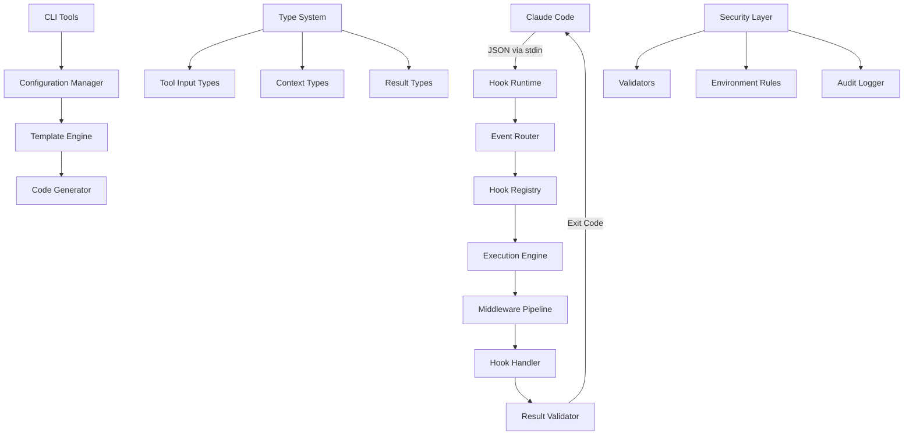
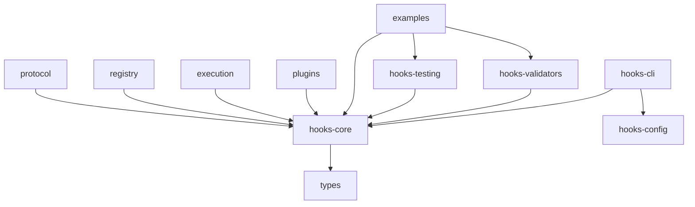
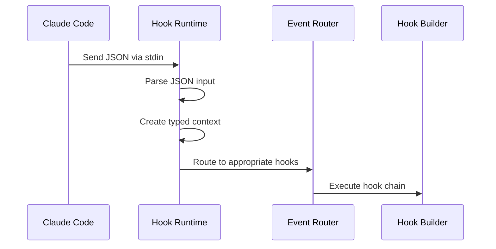
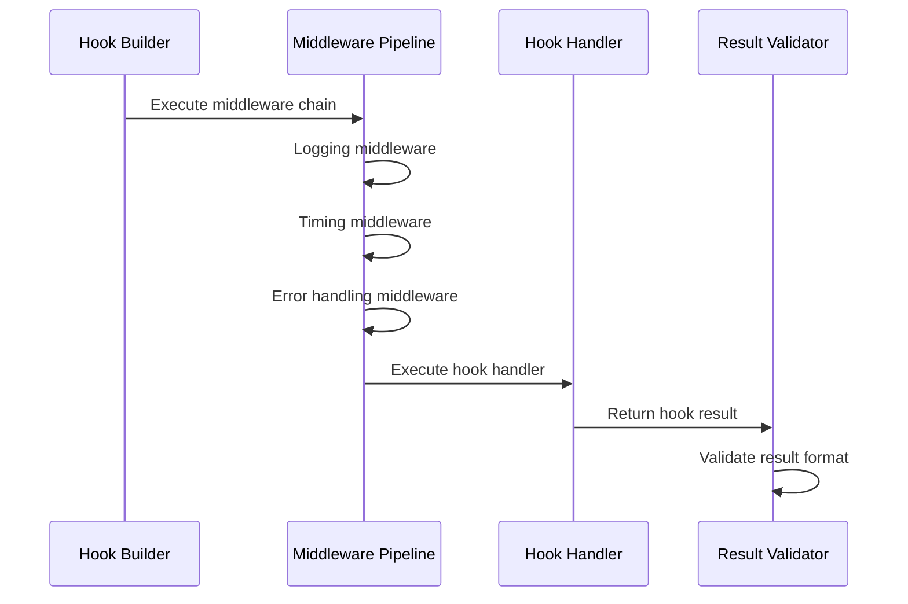
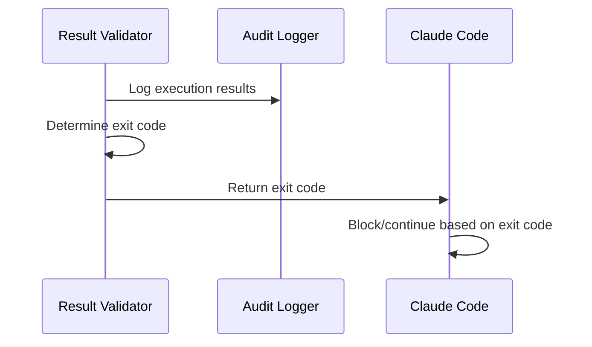

# Architecture Guide

This guide explains the system design, concepts, and patterns that make Carabiner a robust, scalable Claude Code hooks library.

## Table of Contents

- [System Overview](#system-overview)
- [Core Concepts](#core-concepts)
- [Package Architecture](#package-architecture)
- [Hook Execution Lifecycle](#hook-execution-lifecycle)
- [Type System](#type-system)
- [Security Model](#security-model)
- [Performance Considerations](#performance-considerations)
- [Extension Points](#extension-points)

## System Overview

Carabiner is designed as a comprehensive TypeScript monorepo that transforms Claude Code hook development from shell scripting to production-ready applications.

### Design Principles

1. **Type Safety First**: Compile-time validation over runtime checks
2. **Developer Experience**: Intuitive APIs with comprehensive tooling
3. **Production Ready**: Built for scale, monitoring, and maintenance
4. **Modular Design**: Composable packages with clear boundaries
5. **Security by Design**: Defense in depth with environment-specific controls

### Architecture Diagram



## Core Concepts

### Hook Events

Carabiner supports multiple hook events that correspond to different points in the Claude Code lifecycle:

#### PreToolUse

- **When**: Before any tool is executed
- **Purpose**: Validation, security checks, preprocessing
- **Can Block**: Yes (non-zero exit code blocks tool execution)
- **Context**: Tool name, input parameters, session info

#### PostToolUse

- **When**: After tool execution completes
- **Purpose**: Cleanup, formatting, logging, post-processing
- **Can Block**: No (tool already executed)
- **Context**: Tool name, input parameters, tool response, session info

#### Session Events

- **SessionStart**: New Claude session begins
- **UserPromptSubmit**: User submits a prompt
- **Stop**: Session ends
- **SubagentStop**: Subagent workflow ends

### Tool Scoping

Hooks can target specific tools or run universally:

#### Universal Hooks

Run for **all** tools when no tool is specified in configuration.

```typescript
// Runs for Bash, Write, Edit, Read, etc.
const universalHook = HookBuilder.forPreToolUse().withHandler(async (context) => {
  // Universal validation logic
  return HookResults.success(`Validated ${context.toolName}`);
});
```

#### Tool-Specific Hooks

Target specific tools only.

```typescript
// Only runs when toolName === 'Bash'
const bashHook = HookBuilder.forPreToolUse()
  .forTool('Bash')
  .withHandler(async (context) => {
    // Bash-specific logic
    return HookResults.success('Bash validated');
  });
```

### Runtime Architecture

#### Input Processing

1. **Claude Code** sends JSON via stdin to hook executable
2. **Hook Runtime** (`runClaudeHook`) parses JSON and creates typed context
3. **Event Router** determines which hooks should execute
4. **Execution Engine** runs applicable hooks with middleware

#### Context Creation

```typescript
interface HookContext<TEvent, TTool> {
  sessionId: string;
  cwd: string;
  transcriptPath: string;
  event: TEvent;
  toolName: TTool;
  toolInput: GetToolInput<TTool>;
  toolResponse?: string; // Only for PostToolUse
}
```

#### Result Processing

```typescript
interface HookResult {
  success: boolean;
  block?: boolean; // PreToolUse only
  message: string;
  data?: any;
  metadata?: {
    duration?: number;
    timestamp?: string;
  };
}
```

## Package Architecture

The monorepo is organized into focused packages with clear responsibilities:

### Core Packages

#### @outfitter/hooks-core

**Purpose**: Runtime engine, type system, and core APIs

**Key Components**:

- `runClaudeHook()` - Main runtime function
- `HookBuilder` - Fluent API for hook construction
- `HookResults` - Result factory methods
- Type system for tools and contexts
- Middleware pipeline

**Dependencies**: None (foundation package)

#### @outfitter/hooks-cli

**Purpose**: Command-line tools and project scaffolding

**Key Components**:

- Project initialization (`init` command)
- Hook generation (`generate` command)
- Configuration building (`build` command)
- Testing utilities (`test` command)
- Development server (`dev` command)

**Dependencies**: hooks-core, hooks-config

#### @outfitter/hooks-validators

**Purpose**: Security validation and environment-specific rules

**Key Components**:

- `SecurityValidators` - Predefined security rules
- Environment-specific validation
- Custom validator framework
- Audit logging integration

**Dependencies**: hooks-core

#### @outfitter/hooks-testing

**Purpose**: Testing framework and utilities

**Key Components**:

- `createMockContext()` - Mock context generation
- `testHook()` - Hook testing utilities
- Test harness for integration testing
- Performance testing tools

**Dependencies**: hooks-core

#### @outfitter/hooks-config

**Purpose**: Configuration management and templates

**Key Components**:

- Configuration parsing and validation
- Template engine
- Environment-specific overrides
- Settings generation

**Dependencies**: hooks-core

### Supporting Packages

#### packages/examples

Real-world hook implementations demonstrating patterns and best practices.

#### packages/plugins

Extensible plugin system for specialized functionality.

#### packages/types

Shared TypeScript types and utilities.

#### packages/schemas

JSON schemas and validation logic.

### Package Dependencies



## Hook Execution Lifecycle

### 1. Initialization Phase



### 2. Execution Phase



### 3. Result Processing



### Execution Order

For multiple hooks targeting the same event:

1. **Universal hooks** execute first (order: by priority, then registration order)
2. **Tool-specific hooks** execute after universal hooks
3. **Middleware** executes in registration order
4. **Error handling** can short-circuit the pipeline

### Hook Resolution

```typescript
// Hook resolution logic
const resolveHooks = (event: HookEvent, toolName: string) => {
  const hooks: Hook[] = [];

  // 1. Add universal hooks for this event
  const universalHooks = registry.getUniversalHooks(event);
  hooks.push(...universalHooks);

  // 2. Add tool-specific hooks
  const toolHooks = registry.getToolHooks(event, toolName);
  hooks.push(...toolHooks);

  // 3. Sort by priority (higher priority first)
  hooks.sort((a, b) => (b.priority || 0) - (a.priority || 0));

  return hooks;
};
```

## Type System

### Tool Input Types

Each Claude Code tool has strongly typed input parameters:

```typescript
interface BashToolInput {
  command: string;
  timeout?: number;
  description?: string;
}

interface WriteToolInput {
  file_path: string;
  content: string;
}

interface EditToolInput {
  file_path: string;
  old_string: string;
  new_string: string;
  replace_all?: boolean;
}
```

### Context Types

Hook contexts are generically typed based on event and tool:

```typescript
type HookContext<TEvent, TTool> = TEvent extends 'PreToolUse'
  ? PreToolUseContext<TTool>
  : TEvent extends 'PostToolUse'
    ? PostToolUseContext<TTool>
    : SessionEventContext;

interface PreToolUseContext<TTool> {
  sessionId: string;
  cwd: string;
  transcriptPath: string;
  event: 'PreToolUse';
  toolName: TTool;
  toolInput: GetToolInput<TTool>;
}

interface PostToolUseContext<TTool> extends PreToolUseContext<TTool> {
  event: 'PostToolUse';
  toolResponse: string;
}
```

### Type Guards

Type guards provide runtime type safety:

```typescript
function isBashToolInput(input: unknown): input is BashToolInput {
  return (
    typeof input === 'object' &&
    input !== null &&
    'command' in input &&
    typeof (input as any).command === 'string'
  );
}

// Usage in hooks
if (context.toolName === 'Bash' && isBashToolInput(context.toolInput)) {
  // context.toolInput is now typed as BashToolInput
  const { command, timeout } = context.toolInput;
}
```

### Generic Hook Handlers

```typescript
type HookHandler<TEvent = HookEvent, TTool = ToolName> = (
  context: HookContext<TEvent, TTool>,
) => Promise<HookResult>;

// Type-safe hook creation
const createBashHook = <TEvent extends 'PreToolUse' | 'PostToolUse'>(
  event: TEvent,
  handler: HookHandler<TEvent, 'Bash'>,
) => {
  return HookBuilder.for(event).forTool('Bash').withHandler(handler).build();
};
```

## Security Model

### Defense in Depth

Carabiner implements multiple security layers:

#### 1. Input Validation

- **JSON Schema Validation**: Validate input structure
- **Type Guards**: Runtime type checking
- **Sanitization**: Clean potentially dangerous input

#### 2. Environment-Specific Rules

```typescript
switch (process.env.NODE_ENV) {
  case 'production':
    return await ProductionSecurityValidator.validate(context);
  case 'development':
    return await DevelopmentSecurityValidator.validate(context);
  default:
    return await StrictSecurityValidator.validate(context);
}
```

#### 3. Command Pattern Analysis

```typescript
const dangerousPatterns = [
  /rm\s+-rf\s+\//, // rm -rf /
  /sudo\s+rm/, // sudo rm
  /curl.*\|\s*sh/, // curl | sh
  /wget.*\|\s*sh/, // wget | sh
  /dd\s+if=/, // dd if=
  /:\(\)\{.*\}/, // fork bombs
];

for (const pattern of dangerousPatterns) {
  if (pattern.test(command)) {
    return HookResults.block(`Dangerous pattern: ${pattern.source}`);
  }
}
```

#### 4. Audit Logging

```typescript
interface AuditLog {
  timestamp: string;
  sessionId: string;
  event: string;
  toolName: string;
  action: 'allow' | 'block' | 'error';
  reason?: string;
  metadata: Record<string, unknown>;
}
```

### Security Boundaries

#### Runtime Isolation

- Each hook runs in its own process
- Timeouts prevent hanging hooks
- Error handling prevents crashes

#### File System Access

- Hooks run with user permissions
- No privilege escalation
- Working directory restrictions

#### Network Access

- No special network permissions
- Standard user network access
- Can be restricted via environment

## Performance Considerations

### Execution Time

#### Optimization Strategies

1. **Parallel Execution**: Independent hooks run in parallel
2. **Short-Circuit Evaluation**: Fast validation before expensive checks
3. **Caching**: Cache validation results when appropriate
4. **Lazy Loading**: Load validators only when needed

#### Performance Monitoring

```typescript
const timingMiddleware = () => {
  return async (context: HookContext, next: () => Promise<HookResult>) => {
    const start = performance.now();
    const result = await next();
    const duration = performance.now() - start;

    result.metadata = {
      ...result.metadata,
      duration,
      timestamp: new Date().toISOString(),
    };

    return result;
  };
};
```

### Memory Management

#### Context Lifecycle

- Contexts are created per hook execution
- Garbage collected after hook completion
- No persistent state between executions

#### Resource Cleanup

```typescript
try {
  const result = await executeHook(context);
  return result;
} finally {
  // Cleanup resources
  await cleanupTempFiles();
  await closeOpenConnections();
}
```

### Scalability Patterns

#### Hook Registry

```typescript
class HookRegistry {
  private hooks = new Map<string, Hook[]>();

  register(event: HookEvent, tool: string | '*', hook: Hook) {
    const key = `${event}:${tool}`;
    const existing = this.hooks.get(key) || [];
    this.hooks.set(key, [...existing, hook]);
  }

  resolve(event: HookEvent, tool: string): Hook[] {
    const universal = this.hooks.get(`${event}:*`) || [];
    const specific = this.hooks.get(`${event}:${tool}`) || [];
    return [...universal, ...specific];
  }
}
```

## Extension Points

### Custom Middleware

```typescript
interface Middleware {
  (context: HookContext, next: () => Promise<HookResult>): Promise<HookResult>;
}

const customMiddleware: Middleware = async (context, next) => {
  console.log(`Executing hook for ${context.toolName}`);

  try {
    const result = await next();
    console.log(`Hook completed: ${result.success}`);
    return result;
  } catch (error) {
    console.error(`Hook failed:`, error);
    return HookResults.failure('Middleware caught error', error);
  }
};
```

### Custom Validators

```typescript
interface Validator {
  validate(context: HookContext): Promise<ValidationResult>;
}

class CustomSecurityValidator implements Validator {
  async validate(context: HookContext): Promise<ValidationResult> {
    // Custom validation logic
    return { valid: true, message: 'Custom validation passed' };
  }
}
```

### Plugin System

```typescript
interface Plugin {
  name: string;
  version: string;
  hooks?: HookDefinition[];
  middleware?: Middleware[];
  validators?: Validator[];

  initialize?(config: PluginConfig): Promise<void>;
  cleanup?(): Promise<void>;
}

class PluginManager {
  async loadPlugin(plugin: Plugin) {
    await plugin.initialize?.(this.config);

    // Register plugin hooks
    plugin.hooks?.forEach((hook) => {
      this.registry.register(hook.event, hook.tool, hook);
    });

    // Register middleware
    plugin.middleware?.forEach((middleware) => {
      this.middlewareChain.add(middleware);
    });
  }
}
```

### Configuration Extensions

```typescript
interface ConfigExtension {
  extend(config: CarabinerConfig): CarabinerConfig;
}

const productionExtension: ConfigExtension = {
  extend(config) {
    return {
      ...config,
      hooks: {
        ...config.hooks,
        PreToolUse: {
          ...config.hooks.PreToolUse,
          '*': {
            ...config.hooks.PreToolUse?.['*'],
            timeout: 15000, // Longer timeouts in production
          },
        },
      },
    };
  },
};
```

## Best Practices

### 1. Hook Design

- **Single Responsibility**: Each hook should have one clear purpose
- **Fail Fast**: Validate inputs early and return clear error messages
- **Idempotent**: Hooks should be safe to run multiple times
- **Stateless**: Don't rely on external state between executions

### 2. Error Handling

- **Graceful Degradation**: Handle errors without breaking Claude Code
- **Meaningful Messages**: Provide actionable error messages
- **Logging**: Log errors for debugging while not blocking execution
- **Timeouts**: Set appropriate timeouts to prevent hanging

### 3. Performance

- **Quick Validation**: Keep common checks fast
- **Expensive Operations**: Use appropriate timeouts for slow operations
- **Caching**: Cache results when it makes sense
- **Profiling**: Monitor hook execution times

### 4. Security

- **Principle of Least Privilege**: Run with minimal necessary permissions
- **Input Validation**: Validate all inputs thoroughly
- **Environment Awareness**: Use different rules for different environments
- **Audit Logging**: Log security-relevant actions

---

**Understand the architecture and build robust hooks!** 🏗️

Next steps:

- [API Reference](api-reference/) - Explore the complete API
- [Security Best Practices](security.md) - Learn security patterns
- [Performance Guide](performance.md) - Optimize hook performance
