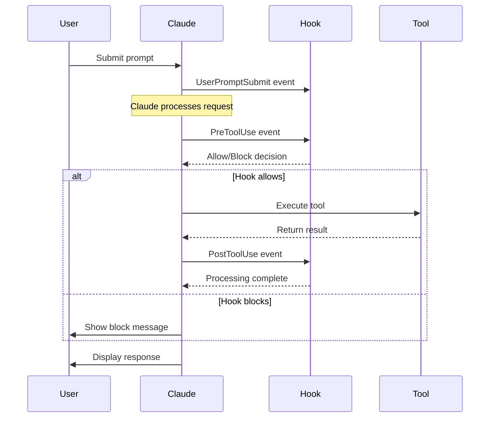

# Core Concepts

Understanding these fundamental concepts will help you build effective and maintainable Claude Code hooks.

## Hook Lifecycle

Hooks execute at specific points during Claude Code's operation:



### Event Details

#### `PreToolUse`
- **When**: Before any tool execution
- **Can Block**: ✅ Yes (return `HookResults.block()`)
- **Use Cases**: Security validation, input sanitization, permission checks
- **Context**: Full tool input available, no tool output yet

```typescript
runClaudeHook(async (context) => {
  // Validate before execution
  if (context.toolName === 'Bash') {
    const { command } = context.toolInput as { command: string };
    
    if (isDangerous(command)) {
      return HookResults.block('Dangerous command blocked');
    }
  }
  
  return HookResults.success('Validation passed');
});
```

#### `PostToolUse`
- **When**: After successful tool execution
- **Can Block**: ❌ No (processing only)
- **Use Cases**: Result processing, logging, formatting, cleanup
- **Context**: Tool input AND output available

```typescript
runClaudeHook(async (context) => {
  // Process results after execution
  if (context.toolName === 'Write') {
    const { file_path } = context.toolInput as { file_path: string };
    
    if (file_path.endsWith('.ts')) {
      await formatTypeScriptFile(file_path);
      console.log(`✅ Formatted ${file_path}`);
    }
  }
  
  return HookResults.success('Post-processing complete');
});
```

#### Other Events

```typescript
runClaudeHook(async (context) => {
  switch (context.event) {
    case 'SessionStart':
      console.log('🚀 New Claude Code session started');
      await initializeSession(context.sessionId);
      break;
      
    case 'UserPromptSubmit':
      console.log(`📝 User submitted: ${context.userPrompt}`);
      await logUserInteraction(context.userPrompt);
      break;
      
    case 'Stop':
      console.log('🛑 Session ending');
      await cleanupSession(context.sessionId);
      break;
  }
  
  return HookResults.success('Event processed');
});
```

## Tool Scoping

One of the most powerful features is the ability to target specific tools or run universally.

### Universal Hooks

Run for **all** tools when no tool is specified:

```typescript
// Configuration
{
  "hooks": {
    "PreToolUse": {
      "*": {  // Universal - runs for ALL tools
        "command": "bun run hooks/universal-security.ts",
        "timeout": 5000
      }
    }
  }
}

// Hook implementation
runClaudeHook(async (context) => {
  console.log(`🌍 Universal check for ${context.toolName}`);
  
  // Handle all tools
  switch (context.toolName) {
    case 'Bash':
      return validateBashCommand(context.toolInput);
    case 'Write': 
      return validateFileWrite(context.toolInput);
    case 'Edit':
      return validateFileEdit(context.toolInput);
    default:
      return HookResults.success('No specific validation needed');
  }
});
```

### Tool-Specific Hooks

Target specific tools only:

```typescript
// Configuration - runs ONLY for Bash
{
  "hooks": {
    "PreToolUse": {
      "Bash": {  // Tool-specific
        "command": "bun run hooks/bash-security.ts",
        "timeout": 10000
      }
    }
  }
}

// Hook implementation
runClaudeHook(async (context) => {
  // This ONLY runs when context.toolName === 'Bash'
  const { command, timeout } = context.toolInput as BashToolInput;
  
  console.log(`🐚 Bash-specific validation: ${command}`);
  
  // Bash-specific security checks
  if (command.includes('sudo')) {
    return HookResults.block('sudo commands not allowed');
  }
  
  return HookResults.success('Bash validation passed');
});
```

### Mixed Configuration

You can combine universal and tool-specific hooks:

```typescript
{
  "hooks": {
    "PreToolUse": {
      "*": {
        "command": "bun run hooks/universal-audit.ts",
        "timeout": 2000
      },
      "Bash": {
        "command": "bun run hooks/bash-security.ts",
        "timeout": 10000  
      },
      "Write": {
        "command": "bun run hooks/file-validation.ts",
        "timeout": 5000
      }
    },
    "PostToolUse": {
      "*": {
        "command": "bun run hooks/universal-cleanup.ts",
        "timeout": 5000
      }
    }
  }
}
```

**Execution Order**: When both universal and tool-specific hooks exist for the same event, **both run in parallel**.

## Context Structure

The `HookContext` provides all information about the current execution:

### Core Properties

```typescript
interface HookContext<TEvent = HookEvent, TTool = ToolName> {
  // Event information
  event: TEvent;                    // 'PreToolUse', 'PostToolUse', etc.
  sessionId: string;                // Unique session identifier
  transcriptPath: string;           // Path to conversation transcript
  cwd: string;                      // Current working directory
  
  // Tool information (for tool events)
  toolName?: TTool;                 // 'Bash', 'Write', 'Edit', etc.
  toolInput?: GetToolInput<TTool>;  // Tool-specific input parameters
  toolResponse?: string;            // Tool output (PostToolUse only)
  
  // Event-specific data
  userPrompt?: string;              // User's prompt (UserPromptSubmit only)
  
  // Environment
  environment: HookEnvironment;     // Environment variables
  rawInput: any;                    // Original JSON input
}
```

### Tool Input Types

Each tool has specific input parameters:

```typescript
// Bash tool
interface BashToolInput {
  command: string;
  timeout?: number;
  description?: string;
}

// Write tool  
interface WriteToolInput {
  file_path: string;
  content: string;
}

// Edit tool
interface EditToolInput {
  file_path: string;
  old_string: string;
  new_string: string;
  replace_all?: boolean;
}

// And many more...
```

### Type Guards for Safety

Use type guards to safely access tool-specific properties:

```typescript
import { isBashToolInput, isWriteToolInput } from '@claude-code/hooks-core';

runClaudeHook(async (context) => {
  if (isBashToolInput(context.toolInput)) {
    // context.toolInput is now typed as BashToolInput
    const { command, timeout } = context.toolInput;
    console.log(`Bash command: ${command}`);
  }
  
  if (isWriteToolInput(context.toolInput)) {
    // context.toolInput is now typed as WriteToolInput
    const { file_path, content } = context.toolInput;
    console.log(`Writing to: ${file_path}`);
  }
  
  return HookResults.success('Processed');
});
```

## Hook Results

Hooks must return a `HookResult` indicating the outcome:

### Success Result

```typescript
return HookResults.success('Operation completed successfully', {
  // Optional metadata
  executionTime: Date.now() - startTime,
  toolsValidated: ['Bash', 'Write'],
  securityLevel: 'high'
});
```

### Failure Result

```typescript
return HookResults.failure('Warning: suspicious activity detected', {
  // Optional error context
  suspiciousCommand: command,
  riskLevel: 'medium',
  timestamp: new Date().toISOString()
});
```

### Block Result (PreToolUse only)

```typescript
// This prevents the tool from executing
return HookResults.block('Dangerous operation blocked', 'security-violation');
```

### Result Properties

```typescript
interface HookResult {
  success: boolean;        // true for success, false for failure/block
  message: string;         // Human-readable message
  data?: any;             // Optional additional data
  block?: boolean;        // true if operation should be blocked
  metadata?: any;         // Optional metadata
}
```

## Runtime Architecture Changes (v2.0)

Understanding the runtime changes is crucial for effective hook development:

### ✅ Stdin-Based Input (New)

**How it works:**
1. Claude Code serializes hook context to JSON
2. JSON is passed to your hook via stdin
3. `runClaudeHook()` automatically parses and provides typed context

```typescript
// Your hook receives this JSON via stdin:
{
  "session_id": "abc123",
  "hook_event_name": "PreToolUse",
  "tool_name": "Bash", 
  "tool_input": {"command": "ls -la"},
  "cwd": "/project",
  "transcript_path": "/tmp/transcript.md"
}

// runClaudeHook() converts it to typed context:
runClaudeHook(async (context) => {
  console.log(context.sessionId);   // "abc123"
  console.log(context.event);       // "PreToolUse"
  console.log(context.toolName);    // "Bash"
  console.log(context.cwd);         // "/project"
  // etc.
});
```

### ✅ Fixed Property Names

**Changed in v2.0:**
- `context.workspacePath` → `context.cwd`
- `context.toolOutput` → `context.toolResponse`
- Metadata is on the **result**, not context

**Migration example:**
```typescript
// ❌ Old (v1.x)
const workingDir = context.workspacePath;
const output = context.toolOutput;

// ✅ New (v2.0)
const workingDir = context.cwd;
const output = context.toolResponse; // PostToolUse only
```

### ✅ Tool Scoping Fixed

**Previously broken**: Tool-specific hooks ran for all tools
**Now working**: Tool-specific hooks only run for their target tool

```typescript
// This configuration now works correctly:
{
  "PreToolUse": {
    "Bash": {
      "command": "bun run bash-only-hook.ts"  // Runs ONLY for Bash
    },
    "Write": {
      "command": "bun run write-only-hook.ts"  // Runs ONLY for Write
    }
  }
}
```

## Advanced Patterns

### Conditional Execution

```typescript
runClaudeHook(async (context) => {
  // Environment-based logic
  const isProd = process.env.NODE_ENV === 'production';
  const isDev = process.env.NODE_ENV === 'development';
  
  if (isProd && context.toolName === 'Bash') {
    // Strict validation in production
    return await strictBashValidation(context);
  }
  
  if (isDev) {
    // Lenient validation in development
    return await lenientValidation(context);
  }
  
  // Default validation
  return await defaultValidation(context);
});
```

### Multi-Tool Logic

```typescript
runClaudeHook(async (context) => {
  // File operations require special handling
  const fileOperations = ['Write', 'Edit', 'MultiEdit'];
  
  if (fileOperations.includes(context.toolName)) {
    return await validateFileOperation(context);
  }
  
  // Network operations
  const networkOperations = ['WebFetch', 'WebSearch'];
  
  if (networkOperations.includes(context.toolName)) {
    return await validateNetworkOperation(context);
  }
  
  // Default handling
  return HookResults.success('No specific validation needed');
});
```

### Async Processing

```typescript
runClaudeHook(async (context) => {
  // Parallel validation
  const validations = await Promise.allSettled([
    validateSecurity(context),
    validateCompliance(context),
    validatePerformance(context)
  ]);
  
  // Check results
  const failures = validations
    .filter(result => result.status === 'rejected')
    .map(result => result.reason);
  
  if (failures.length > 0) {
    return HookResults.failure(`Validations failed: ${failures.join(', ')}`);
  }
  
  return HookResults.success('All validations passed');
});
```

### Error Handling

```typescript
runClaudeHook(async (context) => {
  try {
    // Your hook logic here
    const result = await performValidation(context);
    return HookResults.success('Validation completed', result);
    
  } catch (error) {
    console.error('Hook error:', error);
    
    // Decide whether to block or allow with warning
    if (error.severity === 'critical') {
      return HookResults.block(`Critical error: ${error.message}`);
    } else {
      return HookResults.failure(`Warning: ${error.message}`);
    }
  }
});
```

## Performance Considerations

### Timeout Management

```typescript
// Configure appropriate timeouts
{
  "hooks": {
    "PreToolUse": {
      "*": {
        "command": "bun run quick-validation.ts",
        "timeout": 5000  // 5 seconds for quick checks
      },
      "Bash": {
        "command": "bun run thorough-bash-check.ts", 
        "timeout": 15000  // 15 seconds for complex validation
      }
    },
    "PostToolUse": {
      "Write": {
        "command": "bun run format-file.ts",
        "timeout": 30000  // 30 seconds for formatting
      }
    }
  }
}
```

### Efficient Hook Design

```typescript
runClaudeHook(async (context) => {
  // Early returns for irrelevant tools
  const relevantTools = ['Bash', 'Write', 'Edit'];
  if (!relevantTools.includes(context.toolName)) {
    return HookResults.success('No validation needed');
  }
  
  // Cache expensive computations
  const validationRules = await getCachedValidationRules(context.cwd);
  
  // Parallel processing where possible
  const [securityCheck, complianceCheck] = await Promise.all([
    validateSecurity(context, validationRules),
    validateCompliance(context, validationRules)
  ]);
  
  return HookResults.success('Validation completed');
});
```

## Next Steps

Now that you understand the core concepts:

1. **[Development Guide](./development-guide.md)**: Learn advanced development patterns
2. **[Configuration Guide](./configuration.md)**: Master configuration management  
3. **[Security Guide](./security.md)**: Implement comprehensive security validation
4. **[API Examples](../examples/)**: See these concepts in action
5. **[Testing Guide](./testing.md)**: Learn to test your hooks effectively

The core concepts provide the foundation for building powerful, maintainable hooks that integrate seamlessly with Claude Code's workflow.