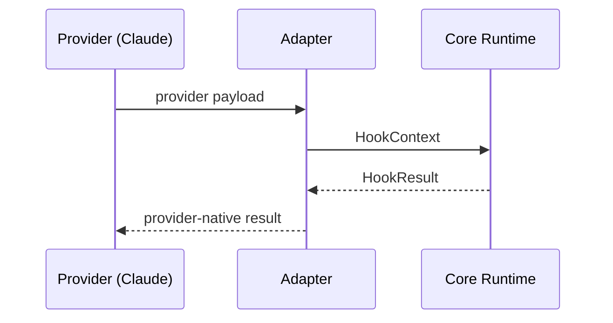

# Hook Provider Adapter Architecture (v0.2)

---

status: Draft owners: Platform Eng (Carabiner) last_updated: 2025-09-20

---

The v0.2 stack introduces a provider adapter layer so Carabiner can normalize Claude Code input/output today while keeping the door open for additional hook providers in the future. This document captures the scope and sequencing for the migration.

## Objectives

- Establish a provider-neutral `HookContext` surface that all runtime utilities, builders, and plugins consume.
  - Minimal v0.2 shape:
    ```ts
    type HookContext = {
      toolCall: { name: string; args: unknown };
      files: Array<{ path: string; content: string }>;
      messages: Array<{ role: 'system' | 'user' | 'assistant'; content: string }>;
      meta?: Record<string, unknown>;
    };
    ```
- Ship a Claude Code adapter that converts between Claude Code payloads and the normalized context without breaking existing hooks.
- Update documentation, testing helpers, and examples to reference the adapter-aware APIs.

### Flow (Claude → Adapter → Core)



## Work Breakdown

1. **Architecture & Documentation (this branch)**
   - Capture the overall plan (this document) and update contributor guidance (`AGENTS.md`).

2. **Provider Interface & Registry**
   - Define `HookProviderAdapter` contracts and default registration inside `@carabiner/hooks-core` (packages/hooks-core).
   - Implement the Claude Code adapter and normalize runtime execution paths.

3. **Runtime + Testing Helpers**
   - Route `runClaudeHook`, `executeHook`, and builder middleware through adapters.
   - Rollout flag: `CARABINER_ADAPTERS_ENABLED=true` gates adapter routing; default off in v0.2, on by default in v0.3.
   - Update `@carabiner/hooks-testing` (packages/hooks-testing) mocks/results to operate on the normalized context.

4. **Examples & CLI**
   - Migrate examples and CLI templates to the adapter-aware helpers.
   - Paths: `examples/*`, `packages/cli/templates/*`
   - Deprecate legacy helpers with warnings in v0.2; remove in v0.4.

5. **Follow-up Docs**
   - Author provider how-to guides explaining how third parties can register additional adapters.

## Success Criteria

- TypeScript compilation succeeds across the monorepo with the adapter layer enabled.
- CI: `pnpm -w ts:check` and `pnpm -w test` pass with `CARABINER_ADAPTERS_ENABLED=true`.
- Legacy hooks using `HookResults.success` continue to work without modification (integration test: `examples/legacy-hooks`).
- Documentation, testing utilities, and starter templates all reference the normalized helpers.
- A third-party sample provider (in `examples/providers/sample`) registers via registry API without touching core runtime code and passes a smoke test.

Track remaining tasks in [.agents/handoff.md](../.agents/handoff.md) as branches land.
